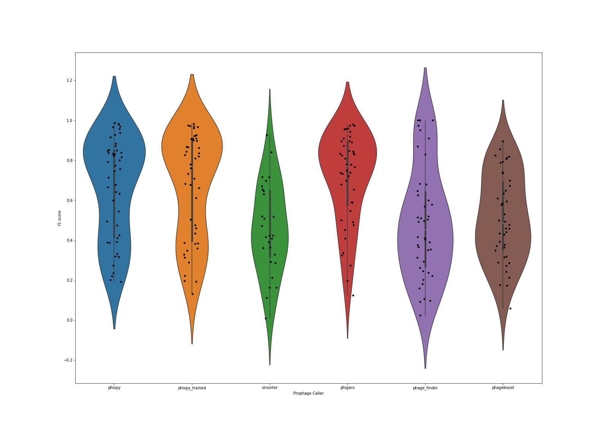
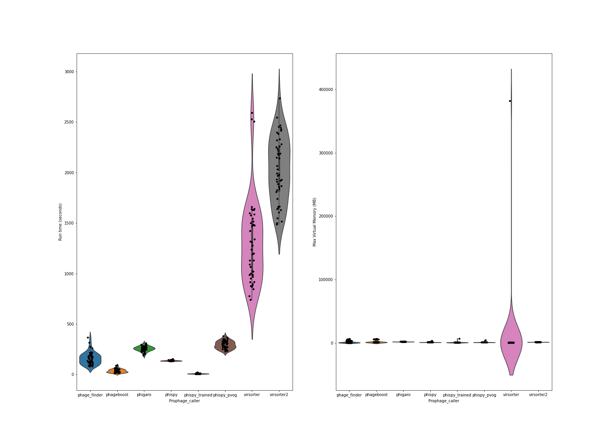

[](https://edwards.sdsu.edu/research)
[](https://opensource.org/licenses/MIT)
[](https://www.zenodo.org/badge/latestdoi/273771924)


# Prophage Prediction Comparisons

Open source comparisons of multiple different prophage predictions

# What is it?

There are multiple different ways of identifying prophages in bacterial genomes, and this is an open source way of 
comparing them. Please feel free to clone this repo, add your tool or code, and then make a pull request.

# What are prophages?

Prophages are viruses that are integrated into bacterial genomes. 
A few computatational biologists are keen to identify those specific regions, because they are more interesting than the 
rest of the genome. For more about prophages, take a look at the home pages for some of the tools listed here.

This site is not intended to be a gentle introduction to prophages, but a FAIR (findable, accessible, interoperable, 
and reusable) data resource for comparing prophage prediction software.

# How do I use it?

To run the tests, first clone the repository and pull the files (requires git and git lfs)
```bash
git clone https://github.com/linsalrob/ProphagePredictionComparisons.git
cd ProphagePredictionComparisons
git submodule update
git lfs install
git lfs update
```
Then run the pipelines (requires snakemake and conda)
```bash
snakemake -s snakefiles/virsorter.smk --use-conda # --profile slurm or -j 16 etc...
```

If you develop prophage prediction software, clone the repository and implement your tool using a 
[snakemake](https://snakemake.readthedocs.io/) pipeline. 
There are several examples in the [snakefiles](snakefiles) directory. 
We have also defined [conda environments](conda/) for each of the tools (see the note below).

Once your tool is working, use it to predict the prophages in the [genbank](genbank) folder, and use the [scripts](scripts) 
to calculate true positive, true negative, false positive, false negative and related statistics.

The [jupyter notebooks](jupyter_notebooks) can be used to plot your data and make images like those below.

If you go to all that work, please make a pull request and we will update this site with your code.

<small>Note: The conda environments are not yet working reliably. Please let us know if you have issues.</small>

# What software is currently included?

We have:
 - [Phage Finder](http://phage-finder.sourceforge.net/) ([original citation](https://www.ncbi.nlm.nih.gov/pmc/articles/PMC1635311/)) Version used: v2.1
 - [PhiSpy](https://github.com/linsalrob/phispy) ([original citation](https://pubmed.ncbi.nlm.nih.gov/22584627/)) Version used: 4.2.6
 - [VirSorter](https://github.com/simroux/VirSorter) ([original citation](https://peerj.com/articles/985/))  Version used: v1.0.6
 - [Phigaro](https://github.com/bobeobibo/phigaro) ([original citation](https://academic.oup.com/bioinformatics/article-abstract/36/12/3882/5822875?redirectedFrom=fulltext)) Version used: v2.3.0
 - [DBSCAN-SWA](https://github.com/HIT-ImmunologyLab/DBSCAN-SWA) ([original citation](https://www.biorxiv.org/content/10.1101/2020.07.12.199018v1.full)) Version used: 2e61b95
 - [PhageBoost](https://github.com/ku-cbd/PhageBoost) ([original citation](https://www.biorxiv.org/content/10.1101/2020.08.09.243022v1.full.pdf)) Version used: 0.1.7
 - [Virsorter2](https://github.com/jiarong/VirSorter2) ([original citation](https://doi.org/10.1186/s40168-020-00990-y)) Version used: 2.2.1

We could not install:
 - [LysoPhD](https://ieeexplore.ieee.org/document/8983280) - We can not find this available online anywhere
 - [ProphET](https://journals.plos.org/plosone/article?id=10.1371/journal.pone.0223364]) - This requires legacy BLAST 
and EMBOSS packages and we could not get it to install and run.

If you know of other tools that should be included please let us know or make a PR.

# How does it work?

We manually curated the prophages in the bacterial genomes in the [genbank](genbank/) files. For each phage we mark both 
the prophage region, and we mark each prophage gene as being a phage gene with a unique `is_phage` tag. We run the 
prediction software on those genbank files, and then compare the predictions with our manual curations.

**We need more manually curated genomes!** Please contribute by adding more manually curated genomes to our data set.

# How can I contribute genomes?

Our [dataset](genbank/) of manually curated genomes is a start, and we welcome submissions from anyone. 
To add a new genome:
1. Please generate a GenBank format file with the _complete_ bacterial genome
2. For the `CDS` entries that are phages, please add the flag `/is_phage="1"` to the entry (the value doesn't matter,
   we check for the presence of the `is_phage` flag and that the value is not zero)
3. Make a clone of this repository and add your genome(s)
4. Make a pull request to add your genome(s) from your clone to the master branch

We welcome annotated microbial genomes from all sources, but we ask that you please _manually_ curate the presence of
phage, because it is that gold-standard manual curation that allows us to accurately compare tools.

# What are the results?

Since we have a notion of truth, we calculate and plot:

 - true positives (TP)
 - true negatives (TN)
 - false positives (FP)
 - false negatives (FN)
 - accuracy : the ratio of the correctly labeled phage genes to the whole pool of genes
 - precision : the ratio of correctly labeled phage genes to all predictions
 - recall : the fraction of actual phage genes we got right
 - specficity : the fraction of non phage genes we got right
 - F1 score : the harmonic mean of precision and recall, and is the best measure when, as in this case, there is a big 
   difference between the number of phage and non-phage genes

Note that these plots are generated by the [jupyter notebooks](jupyter_notebooks) we provide, but please repeat them and 
let us know if we made an error!

We plotted the accuracy, precision, recall, and specificity of the different callers, and in this plot each subplot has 
the same axis.

[comment]: <> (![Accuracy, Precision, Recall, and Specificity of all the prophage callers]&#40;img/sensitivity_specificity.png "Accuracy, Precision, Recall, and Specificity of the prophage callers &#40;clockwise from top left&#41;"&#41;)


[comment]: <> (This is somewhat confusing because of the scale, so here is the same plot but with a different y-axis for each subplot.)

 
")

As noted above, however, these are probably not the most robust data since we have a lot of non-phage genes (ie. 
everything in the genome that is not a prophage), and only a relatively few phage genes. So we rely more on 
F<sub>1</sub> score as shown here:




# What about speed?

Speed is of the essence, and this is where each of the prophage callers really begin to differ. This plot shows time 
(seconds) to complete the predictions, and amount of memory consumed.




# What do the results mean?

Not much! You should always take benchmarks with a grain of salt, because whoever made them (see below) usually has a 
vested interest int their outcome.

You should note, however, that `phage_finder`, the OG of prophage identification is still one of the most robust methods.

# Who did this?

This site was put together by Rob Edwards to compare prophage predictions. Help him out with curated genomes!
